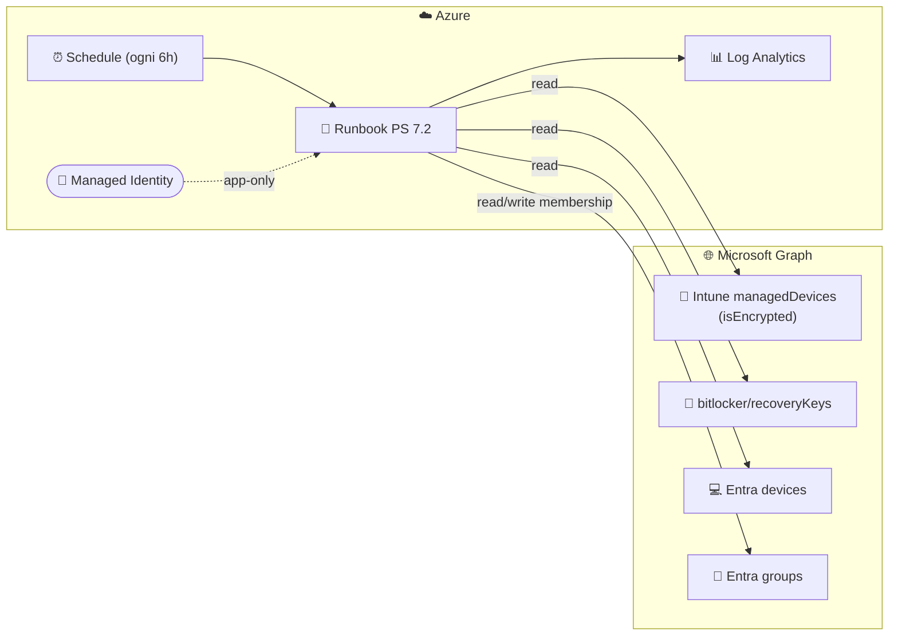

<div align="center">

# 🔐 Nimbus.BitLockerGroupSync

### Dynamic Entra ID security groups driven by Intune BitLocker encryption state & recovery-key escrow

[](https://learn.microsoft.com/powershell/)
[](https://learn.microsoft.com/azure/azure-resource-manager/bicep/)
[](https://learn.microsoft.com/azure/automation/)
[](https://learn.microsoft.com/graph/)
[](https://learn.microsoft.com/mem/intune/)
[](https://learn.microsoft.com/entra/)

[](LICENSE)
[](https://github.com/robgrame/Nimbus.BitLockerGroupSync/actions)
[](https://learn.microsoft.com/entra/identity/managed-identities-azure-resources/)
[](#-security)
[](#-deployment)

</div>

---

## 📖 Overview

**Nimbus.BitLockerGroupSync** è un runbook di **Azure Automation** (PowerShell 7.2) che
crea e mantiene **dinamicamente** gruppi di sicurezza in **Microsoft Entra ID** basandosi su
proprietà dei device gestiti da **Microsoft Intune** che i gruppi dinamici nativi di Entra
**non** possono valutare:

- 💽 **`isEncrypted`** — il disco del device è cifrato con BitLocker.
- 🔑 **BitLocker recovery key** — esiste almeno una recovery key salvata (escrow) su Entra ID.

L'autenticazione a Microsoft Graph avviene **esclusivamente tramite la managed identity**
dell'Automation Account (app-only, **zero segreti**).

> [!NOTE]
> I gruppi dinamici di Entra ID non sanno leggere lo stato di cifratura Intune né la
> presenza di una recovery key. Questo runbook colma esattamente quel gap.

---

## 🧩 Gruppi gestiti

Il runbook crea (se assente) e riconcilia **in modo idempotente** il gruppo principale
**Encrypted**. Gli altri tre gruppi sono **opzionali** e disattivati di default: si abilitano
singolarmente tramite gli appositi flag.

| 🏷️ Gruppo | 📋 Contenuto | 🎯 Uso tipico | Stato |
|---|---|---|---|
| `…-Encrypted` | Device con `isEncrypted = true` | Conformità / reportistica | ✅ **Sempre attivo** |
| `…-NotEncrypted` | Device con `isEncrypted = false` | Remediation / policy di cifratura | ⚪ Opzionale (`EnableNotEncryptedGroup`) |
| `…-KeyEscrowed` | Device con recovery key salvata in Entra | Prova di escrow / audit | ⚪ Opzionale (`EnableKeyEscrowedGroup`) |
| `…-KeyMissing` | Device **cifrati** ma **senza** recovery key | ⚠️ Rischio: nessun recupero possibile | ⚪ Opzionale (`EnableKeyMissingGroup`) |

> Il prefisso (`SG-Intune-BitLocker` di default) è parametrico. In alternativa è possibile
> definire il **nome completo** di ciascun gruppo con i parametri `EncryptedGroupName`,
> `NotEncryptedGroupName`, `KeyEscrowedGroupName`, `KeyMissingGroupName` (se vuoti, il nome
> viene derivato dal prefisso).

> 💡 Il recupero delle recovery key da Graph avviene **solo** se almeno uno tra il gruppo
> `KeyEscrowed`, `KeyMissing` o l'alert soglia è attivo: con la sola configurazione di
> default (solo Encrypted) la chiamata viene saltata per efficienza.

---

## 🏗️ Architettura



**Flusso:** la schedule avvia il runbook → il runbook si autentica con la managed identity →
legge i device Intune, le recovery key e gli oggetti device Entra → calcola gli insiemi
desiderati → riconcilia (add/remove) la membership dei gruppi.

---

## 🔐 Permessi Graph richiesti (application)

Assegnati alla managed identity dallo script [`Grant-GraphPermissions.ps1`](scripts/Grant-GraphPermissions.ps1):

| Permesso | Scopo |
|---|---|
| `DeviceManagementManagedDevices.Read.All` | Leggere i managed device Intune |
| `BitlockerKey.Read.All` | Elencare le BitLocker recovery key |
| `Device.ReadWrite.All` | Risolvere `deviceId → objectId` **e** aggiungere i device come membri dei gruppi |
| `Group.Create` | Creare i gruppi di sicurezza gestiti |
| `GroupMember.ReadWrite.All` | Leggere/aggiornare la membership dei gruppi |

> 🔒 **Least privilege**: nessun `Group.ReadWrite.All`. Solo creazione gruppi + gestione membership.
> `Device.ReadWrite.All` è **richiesto da Graph** per aggiungere oggetti *device* a un gruppo (app-only).

> [!IMPORTANT]
> Gli **app role di Graph non sono RBAC di Azure** e non si assegnano via Bicep/ARM.
> Vanno concessi una tantum con lo script dedicato da un **Privileged Role Administrator**.

---

## 🚀 Deployment

### Prerequisiti

- 🧰 Azure CLI (`az`) **oppure** Azure PowerShell (`Az`)
- 🔑 Ruoli: *Contributor* sulla subscription + *Privileged Role Administrator* su Entra
- 📦 Moduli: `Microsoft.Graph.Authentication`, `Microsoft.Graph.Applications` (per lo script permessi)

### ⚡ One-command deploy

```powershell
.\deploy.ps1 -ResourceGroupName 'rg-bitlocker' -Location 'westeurope' -StartJobNow
```

Lo script: crea il resource group → deploya il Bicep → assegna i permessi Graph → (opz.) avvia un job.

### 🧱 Deploy manuale (Azure CLI)

```bash
az group create -n rg-bitlocker -l westeurope
az deployment group create \
  -g rg-bitlocker \
  -f bicep/main.bicep \
  -p bicep/main.bicepparam

# principalId dagli output, poi:
pwsh ./scripts/Grant-GraphPermissions.ps1 -ManagedIdentityPrincipalId <principalId>
```

---

## ⚙️ Parametri principali

| Parametro | Default | Descrizione |
|---|---|---|
| `location` | `westeurope` | Region delle risorse |
| `automationAccountName` | `aa-bitlocker-groupsync` | Nome Automation Account |
| `runbookContentUri` | *(raw GitHub URL)* | Sorgente del runbook `.ps1` |
| `groupPrefix` | `SG-Intune-BitLocker` | Prefisso naming gruppi |
| `encryptedGroupName` | *(vuoto → `<prefix>-Encrypted`)* | Nome esplicito gruppo Encrypted |
| `notEncryptedGroupName` | *(vuoto → `<prefix>-NotEncrypted`)* | Nome esplicito gruppo NotEncrypted |
| `keyEscrowedGroupName` | *(vuoto → `<prefix>-KeyEscrowed`)* | Nome esplicito gruppo KeyEscrowed |
| `keyMissingGroupName` | *(vuoto → `<prefix>-KeyMissing`)* | Nome esplicito gruppo KeyMissing |
| `enableNotEncryptedGroup` | `false` | Abilita il gruppo NotEncrypted (opzionale) |
| `enableKeyEscrowedGroup` | `false` | Abilita il gruppo KeyEscrowed (opzionale) |
| `enableKeyMissingGroup` | `false` | Abilita il gruppo KeyMissing (opzionale) |
| `targetOperatingSystem` | `Windows` | Filtro OS device |
| `scheduleIntervalHours` | `6` | Cadenza esecuzione |
| `deployLogAnalytics` | `true` | Crea LA + diagnostica |

---

## 🖥️ Runbook — parametri runtime

| Parametro | Default | Descrizione |
|---|---|---|
| `GroupPrefix` | `SG-Intune-BitLocker` | Prefisso dei gruppi |
| `EncryptedGroupName` | *(vuoto → `<prefix>-Encrypted`)* | Nome esplicito gruppo Encrypted |
| `NotEncryptedGroupName` | *(vuoto → `<prefix>-NotEncrypted`)* | Nome esplicito gruppo NotEncrypted |
| `KeyEscrowedGroupName` | *(vuoto → `<prefix>-KeyEscrowed`)* | Nome esplicito gruppo KeyEscrowed |
| `KeyMissingGroupName` | *(vuoto → `<prefix>-KeyMissing`)* | Nome esplicito gruppo KeyMissing |
| `EnableNotEncryptedGroup` | `false` | Abilita il gruppo NotEncrypted (opzionale) |
| `EnableKeyEscrowedGroup` | `false` | Abilita il gruppo KeyEscrowed (opzionale) |
| `EnableKeyMissingGroup` | `false` | Abilita il gruppo KeyMissing (opzionale) |
| `TargetOperatingSystem` | `Windows` | OS dei device valutati |
| `WhatIfOnly` | `$false` | Simulazione senza modifiche |
| `UserAssignedClientId` | *(vuoto)* | Client id di una UAMI (opz.) |
| `KeyMissingAlertThreshold` | `0` | Soglia device cifrati senza key oltre cui inviare alert (0 = off) |
| `AlertWebhookUrl` | *(vuoto)* | Webhook per l'alert soglia (fallback: variable `BitLockerSyncAlertWebhook`) |
| `NotifyWebhookUrl` | *(vuoto)* | Webhook di notifica a ogni run (fallback: variable `BitLockerSyncNotifyWebhook`) |

---

## 🔔 Webhook & notifiche

La soluzione supporta **tre** meccanismi (tutti opzionali):

| Tipo | Direzione | Scopo |
|---|---|---|
| 📣 **Notify webhook** | outbound | A **ogni run** invia il riepilogo JSON (`sync.completed`) ai subscriber (Teams/Logic App/SIEM) |
| 🚨 **Alert webhook** | outbound | Invia un alert solo quando `KeyMissing ≥ KeyMissingAlertThreshold` |
| ▶️ **Trigger webhook** | inbound | URL HTTP `POST` per **avviare** una sync on-demand |

Gli URL outbound si passano come parametro **oppure** come Automation variable cifrata
(`BitLockerSyncNotifyWebhook` / `BitLockerSyncAlertWebhook`), create automaticamente dal Bicep
se valorizzi `notifyWebhookUrl` / `alertWebhookUrl`.

Il **trigger webhook** si crea con:

```powershell
.\deploy.ps1 -ResourceGroupName rg-bitlocker -CreateTriggerWebhook
# L'URI viene mostrato UNA SOLA VOLTA: salvalo subito.
```

Esempio payload di notifica:

```json
{
  "solution": "Nimbus.BitLockerGroupSync",
  "event": "sync.completed",
  "encrypted": 812, "notEncrypted": 14,
  "keyEscrowed": 799, "keyMissing": 13,
  "timestamp": "2026-07-24T17:05:00.000Z"
}
```

---

## ⚡ Ottimizzazioni per grandi tenant

- 🧮 **Scritture in `$batch`**: add via `PATCH members@odata.bind` (chunk da 20), remove via JSON `$batch` con **retry dei subrequest falliti**.
- 🧹 **Filtro stale/retired**: esclude device in `retirePending/retireIssued/wipePending/wipeIssued/...` prima della valutazione.
- 🔁 **Retry sulla replica**: ritenta il `400 Bad Request` dei gruppi appena creati e attende la propagazione.
- ⏱️ **Throttling-aware**: retry con backoff esponenziale e rispetto di `Retry-After`.
- 🧾 **Esito verificabile**: se una riconciliazione lascia errori, il job **fallisce** e la notifica riporta `sync.completed_with_errors`.

> ℹ️ La *delta query* è stata valutata ma **non adottata**: Intune non espone un endpoint delta
> supportato per `managedDevices` e il modello di riconciliazione richiede comunque lo stato completo
> a ogni run. Il full sync con `$select` + `$batch` è la scelta corretta e più robusta.

---

## 🤖 CI/CD & assegnazione permessi

- ✅ **GitHub Actions** (`.github/workflows/ci.yml`): `bicep build` + **PSScriptAnalyzer** + **Pester**.
- 🔐 **Assegnazione permessi automatica** (opt-in): `assignGraphPermissions=true` +
  `permissionGrantIdentityId`/`permissionGrantIdentityClientId` usa un `deploymentScript` per assegnare
  gli app role Graph (richiede una UAMI con `AppRoleAssignment.ReadWrite.All`). In alternativa, lo
  script manuale [`Grant-GraphPermissions.ps1`](scripts/Grant-GraphPermissions.ps1).

---

## 🛡️ Security

- ✅ **Zero segreti**: solo managed identity, nessuna app registration con client secret.
- ✅ **Least privilege**: nessun `Group.ReadWrite.All`; solo `Group.Create` + `GroupMember.ReadWrite.All` + i read scoperti.
- ✅ **Idempotente**: calcola il diff e applica solo le differenze.
- ✅ **Auditabile**: log verbosi + Log Analytics opzionale.

---

## 🔍 Troubleshooting

| Sintomo | Causa probabile | Rimedio |
|---|---|---|
| `Insufficient privileges` | Permessi Graph non propagati | Attendere qualche minuto / rilanciare lo script permessi |
| `403` su add device | Manca `Device.ReadWrite.All` | Assegnare l'app role e attendere la propagazione |
| `400` add su gruppo nuovo | Replica del gruppo in corso | Gestito automaticamente con retry; riprovare al run successivo |
| `Modulo Microsoft.Graph.Authentication non disponibile` | Modulo non importato | Verificare la risorsa `powerShell72Modules` |
| Device non aggiunti | `azureADDeviceId` assente o device non in Entra | Verificare Entra join / registrazione |
| Molti in `NonRisolti` | Mismatch deviceId ↔ objectId | Verificare sync Intune/Entra |

---

## 💡 Advisory & miglioramenti futuri

- 📊 Emissione di metriche custom su Log Analytics + alert nativi su crescita di `KeyMissing`.
- 🗃️ Persistenza dello storico esiti (Storage Table) per trend e reportistica.
- 🔗 Trigger event-driven da Intune/Entra tramite Logic App verso il webhook di trigger.
- 🧪 Ampliamento della suite Pester con mock delle chiamate Graph.

---

## 📂 Struttura del repository

```
Nimbus.BitLockerGroupSync/
├── runbook/   Sync-BitLockerComplianceGroups.ps1   # 📜 Logica del runbook
├── bicep/     main.bicep + main.bicepparam         # 🧱 Infrastructure as Code
│              graphPermissions.bicep               # 🔐 Modulo deploymentScript (opt-in)
├── scripts/   Grant-GraphPermissions.ps1           # 🔐 Assegnazione app role Graph (manuale)
├── tests/     Solution.Tests.ps1                   # 🧪 Test Pester
├── .github/workflows/ci.yml                        # 🤖 CI (bicep + PSSA + Pester)
├── PSScriptAnalyzerSettings.psd1                   # 🔎 Regole linter
├── deploy.ps1                                       # 🚀 Orchestratore end-to-end
└── docs/                                            # 📚 Documentazione aggiuntiva
```

---

## 📜 License

Distribuito con licenza **MIT**. Vedi [`LICENSE`](LICENSE).

<div align="center">

Made with ❤️ for secure endpoints · **Nimbus** suite

</div>
