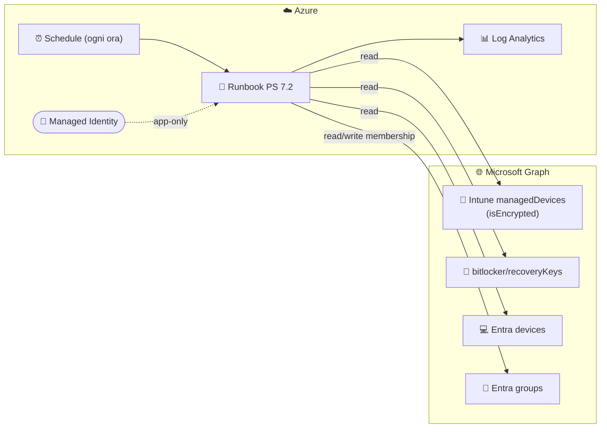
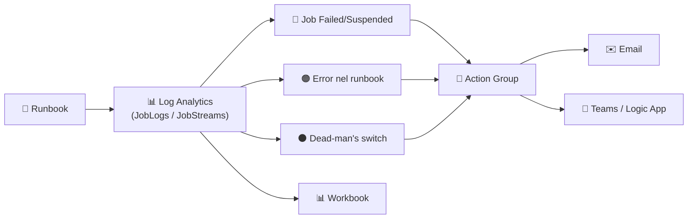
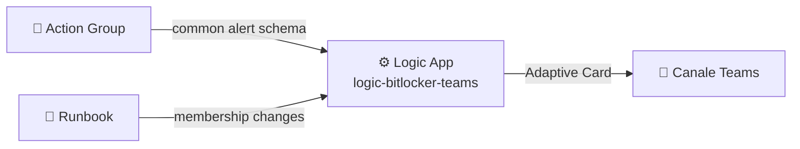

<div align="center">

# 🔐 BitLocker Group Sync

### Dynamic Entra ID security groups driven by Intune BitLocker encryption state & recovery-key escrow

**Versione soluzione: 1.3.2**

[](https://learn.microsoft.com/powershell/)
[](https://learn.microsoft.com/azure/azure-resource-manager/bicep/)
[](https://learn.microsoft.com/azure/automation/)
[](https://learn.microsoft.com/graph/)
[](https://learn.microsoft.com/mem/intune/)
[](https://learn.microsoft.com/entra/)

[](LICENSE)
[](https://github.com/robgrame/Nimbus.BitLockerGroupSync/actions)
[](https://learn.microsoft.com/entra/identity/managed-identities-azure-resources/)
[](#-security)
[](#-deployment)

</div>

---

## 📖 Overview

**Nimbus.BitLockerGroupSync** è un runbook di **Azure Automation** (PowerShell 7.2) che
crea e mantiene **dinamicamente** gruppi di sicurezza in **Microsoft Entra ID** basandosi su
proprietà dei device gestiti da **Microsoft Intune** che i gruppi dinamici nativi di Entra
**non** possono valutare:

- 💽 **`isEncrypted`** — il disco del device è cifrato con BitLocker.
- 🔑 **BitLocker recovery key** — esiste almeno una recovery key salvata (escrow) su Entra ID.

L'autenticazione a Microsoft Graph è configurabile:

- **UAMI dedicata**, creata dal deployment e collegata all'Automation Account;
- **App Registration con certificato** conservato come Automation Certificate;
- **App Registration con client secret** conservato come Automation Variable cifrata.

Managed Identity e certificato sono le modalità raccomandate.

> [!NOTE]
> I gruppi dinamici di Entra ID non sanno leggere lo stato di cifratura Intune né la
> presenza di una recovery key. Questo runbook colma esattamente quel gap.

La stessa distribuzione include un secondo runbook, **`Sync-BitLockerExtensionAttribute`**,
che replica lo stato `isEncrypted` nel device Entra:

| Stato Intune | Attributo Entra |
|---|---|
| `isEncrypted = true` | `extensionAttribute10 = "enc"` |
| `isEncrypted = false` | `extensionAttribute10 = "notenc"` |

Il secondo runbook usa lo stesso Automation Account e la stessa identità, ma dispone di
schedule e configurazione runtime autonome. Aggiorna solo i valori non conformi e ignora
device stale, non risolti o con stato `isEncrypted` nullo. La schedule parte 30 minuti
dopo quella del runbook gruppi per evitare picchi simultanei su Graph.

Il mapping viene letto a ogni job da tre Automation Variables globali, modificabili
direttamente dall'Automation Account senza ripubblicare il runbook:

| Automation Variable | Valore iniziale |
|---|---|
| `BitLockerExtensionAttributeName` | `extensionAttribute10` |
| `BitLockerExtensionAttributeEncryptedValue` | `enc` |
| `BitLockerExtensionAttributeNotEncryptedValue` | `notenc` |

I valori Bicep corrispondenti inizializzano queste variabili solo se assenti.
Dopo la prima creazione, modificarli nel file parametri non sovrascrive i valori
operativi: gli aggiornamenti successivi vanno effettuati nell'Automation Account.

`deploy.ps1` crea questi valori solo se assenti. I deploy successivi preservano
le modifiche effettuate dal portale o via API.

Per sicurezza la funzionalità è disabilitata nel template Bicep e deve essere attivata
esplicitamente. Se `extensionAttribute10` contiene valori diversi da `enc`/`notenc`, il
runbook fallisce senza applicare modifiche, salvo consenso esplicito tramite
`extensionAttributeAllowValueTakeover=true` in un file parametri locale deliberatamente
selezionato. I device usciti dal perimetro mantengono
il valore precedente; la pulizia opzionale si abilita con
`clearManagedValuesForOutOfScopeDevices=true`.

---

## 🧩 Gruppi gestiti

Il runbook crea (se assente) e riconcilia **in modo idempotente** il gruppo principale
**Encrypted**. Gli altri tre gruppi sono **opzionali** e disattivati di default: si abilitano
singolarmente tramite gli appositi flag.

| 🏷️ Gruppo | 📋 Contenuto | 🎯 Uso tipico | Stato |
|---|---|---|---|
| `…-Encrypted` | Device con `isEncrypted = true` | Conformità / reportistica | ✅ **Sempre attivo** |
| `…-NotEncrypted` | Device con `isEncrypted = false` | Remediation / policy di cifratura | ⚪ Opzionale (`EnableNotEncryptedGroup`) |
| `…-KeyEscrowed` | Device con recovery key salvata in Entra | Prova di escrow / audit | ⚪ Opzionale (`EnableKeyEscrowedGroup`) |
| `…-KeyMissing` | Device **cifrati** ma **senza** recovery key | ⚠️ Rischio: nessun recupero possibile | ⚪ Opzionale (`EnableKeyMissingGroup`) |

> Il prefisso è opzionale. La configurazione predefinita usa il nome completo
> `Intune - BitLocker Encrypted`; in alternativa è possibile definire ciascun gruppo
> con i parametri `EncryptedGroupName`,
> `NotEncryptedGroupName`, `KeyEscrowedGroupName`, `KeyMissingGroupName` (se vuoti, il nome
> viene derivato dal prefisso).

> 💡 Il recupero delle recovery key da Graph avviene **solo** se almeno uno tra il gruppo
> `KeyEscrowed`, `KeyMissing` o l'alert soglia è attivo: con la sola configurazione di
> default (solo Encrypted) la chiamata viene saltata per efficienza.

> 🔒 **Master switch `EnableKeyEscrowCheck`** (default `true`): la verifica dell'escrow della
> recovery key è un controllo "puntuale" su Entra. Impostando `EnableKeyEscrowCheck=false` il
> runbook **salta del tutto** il recupero delle chiavi e **disabilita** i gruppi `KeyEscrowed`/
> `KeyMissing` e l'alert di soglia, a prescindere dai loro flag. Il gruppo **Encrypted**
> (basato solo su `isEncrypted`) **non è influenzato**.

---

## 🏗️ Architettura



**Flusso:** la schedule avvia il runbook → il runbook si autentica con la managed identity →
legge i device Intune, le recovery key e gli oggetti device Entra → calcola gli insiemi
desiderati → riconcilia (add/remove) la membership dei gruppi.

---

## 🔐 Permessi Graph richiesti (application)

Assegnati alla managed identity dallo script [`Grant-GraphPermissions.ps1`](scripts/Grant-GraphPermissions.ps1):

| Permesso | Scopo |
|---|---|
| `DeviceManagementManagedDevices.Read.All` | Leggere i managed device Intune |
| `BitlockerKey.Read.All` | Elencare le BitLocker recovery key |
| `Device.ReadWrite.All` | Risolvere `deviceId → objectId` **e** aggiungere i device come membri dei gruppi |
| `Group.Create` | Creare i gruppi di sicurezza gestiti |
| `GroupMember.ReadWrite.All` | Leggere/aggiornare la membership dei gruppi |

> 🔒 **Least privilege**: nessun `Group.ReadWrite.All`. Solo creazione gruppi + gestione membership.
> `Device.ReadWrite.All` è **richiesto da Graph** per aggiungere oggetti *device* a un gruppo (app-only).

> [!IMPORTANT]
> Gli **app role di Graph non sono RBAC di Azure** e non si assegnano via Bicep/ARM.
> Vanno concessi una tantum con lo script dedicato da un **Privileged Role Administrator**.

---

## 🚀 Deployment

Per la procedura completa destinata al cliente, inclusi ruoli, prerequisiti,
separazione Azure/Entra, verifiche, rollback e handover, vedere
[`docs/DEPLOYMENT-GUIDE.md`](docs/DEPLOYMENT-GUIDE.md).

### Prerequisiti

- 🧰 Azure CLI (`az`) **oppure** Azure PowerShell (`Az`)
- 🔑 Ruoli: *Contributor* sulla subscription + *Privileged Role Administrator* su Entra
- 📦 Moduli: `Microsoft.Graph.Authentication`, `Microsoft.Graph.Applications` (per lo script permessi)

### ⚡ One-command deploy

```powershell
.\deploy.ps1 `
  -ResourceGroupName 'rg-bitlocker' `
  -Location 'westeurope' `
  -TenantId '<tenant-id>' `
  -SubscriptionId '<subscription-id>'
```

La selezione dei runbook è esplicita:

```powershell
# Entrambi
.\deploy.ps1 -ResourceGroupName 'rg-bitlocker' -RunbookSelection All

# Solo gruppi Entra
.\deploy.ps1 -ResourceGroupName 'rg-bitlocker' -RunbookSelection GroupSync

# Solo extensionAttribute10
.\deploy.ps1 -ResourceGroupName 'rg-bitlocker' -RunbookSelection ExtensionAttribute
```

Con `-GrantGraphPermissions`, lo script assegna alla Managed Identity soltanto i
permessi Graph richiesti dalla selezione. `ExtensionAttribute` richiede
`DeviceManagementManagedDevices.Read.All` e `Device.ReadWrite.All`; `GroupSync` e
`All` includono i permessi per creazione gruppi e membership e aggiungono
`BitlockerKey.Read.All` soltanto quando `enableKeyEscrowCheck=true`.
Gli app role gestiti dalla soluzione ma non più necessari vengono revocati.
In questa modalità il deployment crea o aggiorna prima l'infrastruttura con i
job schedulati disabilitati, completa il grant amministrativo e solo dopo abilita
schedule e dead-man alert. Un grant interrotto non lascia job attivi.

Per repository privati impostare `deployRunbookContentLinks=false` nel file
`.bicepparam`: `deploy.ps1` importa e pubblica i due script direttamente dai file
locali, evitando content link GitHub non autenticabili da Azure Automation.

Se `-RunbookSelection` viene omesso, sono rispettati i flag nel file
`.bicepparam`. Quando la selezione esclude un runbook già distribuito, il deploy
ne rimuove collegamenti schedulati, schedule, runbook e variabile runtime; rimuove
inoltre l'alert dead-man secondario non più necessario.

Lo script installa Azure CLI, Bicep e moduli mancanti, crea il resource group e
distribuisce il Bicep senza attivare la schedule. Le comunicazioni EML per
l'amministratore Entra sono documenti separati nella cartella `templates`. Dopo
la conferma delle permission:

```powershell
.\deploy.ps1 `
  -ResourceGroupName 'rg-bitlocker' `
  -Location 'westeurope' `
  -TenantId '<tenant-id>' `
  -SubscriptionId '<subscription-id>' `
  -SkipBootstrap `
  -PermissionsConfirmed `
  -StartJobNow
```

### 🧱 Deploy manuale (Azure CLI)

```bash
az group create -n rg-bitlocker -l westeurope
az deployment group create \
  -g rg-bitlocker \
  -f bicep/main.bicep \
  -p bicep/main.bicepparam

# principalId dagli output, poi:
pwsh ./scripts/Grant-GraphPermissions.ps1 -ManagedIdentityPrincipalId <principalId>
```

---

## ⚙️ Parametri principali

| Parametro | Default | Descrizione |
|---|---|---|
| `location` | `westeurope` | Region delle risorse |
| `automationAccountName` | `aa-bitlocker-groupsync` | Nome Automation Account |
| `runbookContentUri` | *(raw GitHub URL)* | Sorgente del runbook `.ps1` |
| `deployExtensionAttributeRunbook` | `false` | Distribuisce il runbook di sincronizzazione extension attribute |
| `extensionAttributeRunbookContentUri` | *(raw GitHub URL)* | Sorgente del secondo runbook |
| `extensionAttributeName` | `extensionAttribute10` | Attributo Entra da aggiornare |
| `extensionAttributeEncryptedValue` | `enc` | Valore per device cifrati |
| `extensionAttributeNotEncryptedValue` | `notenc` | Valore per device non cifrati |
| `extensionAttributeAllowValueTakeover` | `false` | Consenso esplicito a sovrascrivere valori non gestiti già presenti |
| `clearManagedValuesForOutOfScopeDevices` | `false` | Azzera `enc`/`notenc` sui device non più nel perimetro |
| `extensionAttributeScheduleIntervalHours` | `1` | Cadenza autonoma del secondo runbook |
| `groupPrefix` | *(vuoto)* | Prefisso opzionale per il naming dei gruppi |
| `encryptedGroupName` | `Intune - BitLocker Encrypted` | Nome esplicito gruppo Encrypted |
| `notEncryptedGroupName` | *(vuoto → `<prefix>-NotEncrypted`)* | Nome esplicito gruppo NotEncrypted |
| `keyEscrowedGroupName` | *(vuoto → `<prefix>-KeyEscrowed`)* | Nome esplicito gruppo KeyEscrowed |
| `keyMissingGroupName` | *(vuoto → `<prefix>-KeyMissing`)* | Nome esplicito gruppo KeyMissing |
| `enableNotEncryptedGroup` | `false` | Abilita il gruppo NotEncrypted (opzionale) |
| `enableKeyEscrowedGroup` | `false` | Abilita il gruppo KeyEscrowed (opzionale) |
| `enableKeyMissingGroup` | `false` | Abilita il gruppo KeyMissing (opzionale) |
| `enableKeyEscrowCheck` | `false` | Master switch verifica escrow: `false` salta il recupero chiavi e disabilita KeyEscrowed/KeyMissing/alert |
| `targetOperatingSystem` | `Windows` | Filtro OS device |
| `scheduleIntervalHours` | `1` | Cadenza oraria dell'esecuzione |
| `deployLogAnalytics` | `true` | Crea LA + diagnostica |

---

## 🖥️ Runbook — parametri runtime

Il deployment salva la configurazione non sensibile anche nella Automation Variable
`BitLockerSyncRuntimeConfig`. Gli avvii manuali dal portale la caricano automaticamente;
i parametri forniti esplicitamente da schedule, webhook o PowerShell hanno precedenza.

Il runbook extension attribute mantiene autenticazione e opzioni di sicurezza in
`BitLockerExtensionAttributeRuntimeConfig`, mentre nome attributo e valori `enc` /
`notenc` risiedono nelle tre Automation Variables globali elencate nell'overview.

| Parametro | Default | Descrizione |
|---|---|---|
| `GroupPrefix` | *(vuoto)* | Prefisso opzionale dei gruppi |
| `EncryptedGroupName` | `Intune - BitLocker Encrypted` | Nome esplicito gruppo Encrypted |
| `NotEncryptedGroupName` | *(vuoto → `<prefix>-NotEncrypted`)* | Nome esplicito gruppo NotEncrypted |
| `KeyEscrowedGroupName` | *(vuoto → `<prefix>-KeyEscrowed`)* | Nome esplicito gruppo KeyEscrowed |
| `KeyMissingGroupName` | *(vuoto → `<prefix>-KeyMissing`)* | Nome esplicito gruppo KeyMissing |
| `EnableNotEncryptedGroup` | `false` | Abilita il gruppo NotEncrypted (opzionale) |
| `EnableKeyEscrowedGroup` | `false` | Abilita il gruppo KeyEscrowed (opzionale) |
| `EnableKeyMissingGroup` | `false` | Abilita il gruppo KeyMissing (opzionale) |
| `EnableKeyEscrowCheck` | `true` | Master switch verifica escrow: `false` salta il recupero chiavi e disabilita KeyEscrowed/KeyMissing/alert soglia |
| `TargetOperatingSystem` | `Windows` | OS dei device valutati |
| `WhatIfOnly` | `$false` | Simulazione senza modifiche |
| `ManagedIdentityClientId` | *(fornito dal deployment)* | Client ID della UAMI dedicata |
| `KeyMissingAlertThreshold` | `0` | Soglia device cifrati senza key oltre cui inviare alert (0 = off) |
| `AlertWebhookUrl` | *(vuoto)* | Webhook per l'alert soglia (fallback: variable `BitLockerSyncAlertWebhook`) |
| `NotifyWebhookUrl` | *(vuoto)* | Webhook di notifica quando cambiano membership o si verificano errori (fallback: variable `BitLockerSyncNotifyWebhook`) |
| `NotificationDetailLimit` | `50` | Numero massimo di modifiche membership incluse nel payload (0-200) |
| `EnableMembershipDetailLogging` | `true` | Registra nome e object ID di ogni device aggiunto con successo, per la vista di dettaglio del workbook |

---

## 🔔 Webhook & notifiche

La soluzione supporta **tre** meccanismi (tutti opzionali):

| Tipo | Direzione | Scopo |
|---|---|---|
| 📣 **Notify webhook** | outbound | Quando cambiano membership o si verificano errori invia conteggi e device interessati (`sync.membership_changed`) |
| 🚨 **Alert webhook** | outbound | Invia un alert solo quando `KeyMissing ≥ KeyMissingAlertThreshold` |
| ▶️ **Trigger webhook** | inbound | URL HTTP `POST` per **avviare** una sync on-demand |

Gli URL outbound si passano come parametro **oppure** come Automation variable cifrata
(`BitLockerSyncNotifyWebhook` / `BitLockerSyncAlertWebhook`), create automaticamente dal Bicep
se valorizzi `notifyWebhookUrl` / `alertWebhookUrl`.

Il **trigger webhook** si crea con:

```powershell
.\deploy.ps1 -ResourceGroupName rg-bitlocker -CreateTriggerWebhook
# L'URI viene mostrato UNA SOLA VOLTA: salvalo subito.
```

Il dettaglio viene limitato da `NotificationDetailLimit`; `changesTruncated` indica
quante modifiche ulteriori non sono incluse. Se non ci sono modifiche né errori, il
webhook non viene chiamato.

Esempio payload di notifica:

```json
{
  "solution": "Nimbus.BitLockerGroupSync",
  "event": "sync.membership_changed",
  "added": 2,
  "removed": 1,
  "changeCount": 3,
  "changes": [
    {
      "operation": "Add",
      "groupName": "Intune - BitLocker Encrypted",
      "deviceName": "PC-001",
      "objectId": "00000000-0000-0000-0000-000000000000"
    }
  ],
  "changesTruncated": 0,
  "encrypted": 812, "notEncrypted": 14,
  "keyEscrowed": 799, "keyMissing": 13,
  "timestamp": "2026-07-24T17:05:00.000Z"
}
```

---

## 📡 Monitoraggio & alerting (nativo Azure)

Oltre ai webhook applicativi (che scattano solo se il runbook **arriva in fondo**), la
soluzione include un monitoraggio **nativo Azure** indipendente dal runbook, che copre anche
i casi in cui il runbook **non parte** o **crasha**. Tutto è opt-in via `deployMonitoring`
(richiede `deployLogAnalytics = true`) e si basa sui diagnostic log (`JobLogs` + `JobStreams`)
già inviati al workspace Log Analytics.



### 🔔 Alert rules

| Alert | Trigger (KQL) | Finestra / Freq. | Severità |
|---|---|---|---|
| 🔴 **Job Failed/Suspended** | `JobLogs` con `ResultType in (Failed, Suspended, Stopped)` | 15 min / 5 min | Sev1 |
| 🟠 **Errore nel runbook** | `JobStreams` con `StreamType = Error` o messaggio `[ERROR]` | 15 min / 5 min | Sev2 |
| ⚫ **Dead-man's switch** | 0 job `Completed` nella finestra (schedule off, MI/Graph down, mai avviato) | 12 h / 1 h | Sev1 |

> 💡 Il **dead-man's switch** è la rete di sicurezza chiave: intercetta i problemi che i
> webhook applicativi **non** possono segnalare (perché il runbook non gira). La finestra
> accetta solo i valori supportati da Azure Monitor: `2, 3, 4, 5, 6, 12, 24, 48` ore.

### 📢 Action Group & Workbook

- **Action Group** `ag-bitlocker-sync`: invia gli alert a una o più **email** (`alertEmails`)
  e, se abilitata la Logic App Teams (o valorizzato `alertActionWebhookUrl`), a un **webhook**.
- **Workbook** *Nimbus.BitLockerGroupSync - Monitoring*: dashboard con trend degli esiti job,
  ultimi job, errori recenti, righe di riepilogo e dettaglio dei device aggiunti ai gruppi.

La vista **Device aggiunti ai gruppi** mostra data/ora, gruppo, nome device, object ID e job.
I dati sono generati solo per aggiunte effettivamente riuscite e rispettano il filtro temporale
del workbook. `enableMembershipDetailLogging=false` disabilita questa telemetria dettagliata
quando si vuole ridurre il volume dei JobStreams.

### 💬 Notifiche Teams (Logic App)

Una **Logic App (Consumption)** opzionale (`deployTeamsLogicApp`) fa da *traduttore* verso
Teams. Riceve sia il *common alert schema* dall'Action Group sia il payload delle modifiche
membership dal runbook, seleziona la card appropriata e la posta al canale.



- Il wiring **Action Group/Runbook → Logic App** è automatico: lo stesso callback firmato viene
  collegato all'Action Group e salvato nella Automation variable cifrata
  `BitLockerSyncNotifyWebhook`.
- L'unico valore da fornire è l'**URL di destinazione Teams** (`teamsWebhookUrl`), di tipo
  **Workflows / Power Automate** (in Teams: canale → *…* → **Workflows** → *"Post to a channel
  when a webhook request is received"*).
- Se `teamsWebhookUrl` è **vuoto**, la Logic App viene comunque distribuita ma **non invia**
  (una condizione salta il POST): puoi impostare l'URL in seguito con un redeploy, senza
  toccare il resto.

| Parametro | Default | Descrizione |
|---|---|---|
| `deployTeamsLogicApp` | `false` | Crea la Logic App di notifica Teams |
| `teamsLogicAppName` | `logic-bitlocker-teams` | Nome della Logic App |
| `teamsWebhookUrl` | *(vuoto)* | URL Workflows del canale Teams (vuoto = POST disabilitato) |

#### 🔗 Come ottenere l'URL del canale Teams (Workflows)

> [!NOTE]
> L'URL **non si genera via script**: è un endpoint legato al canale/tenant e all'identità
> di chi lo crea, quindi si ottiene una tantum dalla UI. Microsoft ha sostituito i vecchi
> *Incoming Webhook connector* (in ritiro) con i flussi **Workflows / Power Automate**.

1. In Teams apri il **canale** che deve ricevere le notifiche.
2. Clicca sui **⋯** (More options) accanto al nome del canale → **Workflows**
   (in alternativa: app **Workflows** dalla barra laterale, oppure *Power Automate*).
3. Cerca e seleziona il template **“Post to a channel when a webhook request is received”**
   (in italiano *“Pubblica in un canale quando viene ricevuta una richiesta webhook”*).
4. Conferma/accedi con l'account (serve il consenso), poi scegli **Team** e **Canale** di
   destinazione.
5. Completa la creazione: il flusso mostra un **URL HTTP POST** — è quello di `teamsWebhookUrl`.
   Copialo subito (puoi comunque recuperarlo riaprendo il flusso in Power Automate → trigger
   *“When a Teams webhook request is received”*).
6. Non salvare l'URL nel repository. Acquisiscilo come `SecureString`:

   ```powershell
   $TeamsWebhookUrl = Read-Host 'URL Workflows del canale Teams' -AsSecureString
   ```

7. Ridistribuisci lo stack passando il valore protetto:

   ```powershell
   .\deploy.ps1 `
     -ResourceGroupName 'RG-ENCRYPTED_DEVICES' `
     -Location 'italynorth' `
     -ParameterFile '.\bicep\main.bicepparam' `
     -SkipBootstrap `
     -PermissionsConfirmed `
     -TeamsWebhookUrl $TeamsWebhookUrl
   ```

> [!TIP]
> **Test rapido senza aspettare un alert reale**: invia un payload di esempio al trigger della
> Logic App (recuperi l'URL con `Get-AzLogicAppTriggerCallbackUrl -ResourceGroupName RG-BLKGM
> -Name logic-bitlocker-teams -TriggerName manual`) con un body in *common alert schema*
> (`{ "schemaId":"azureMonitorCommonAlertSchema", "data":{ "essentials":{ ... } } }`) e
> verifica che la card arrivi nel canale.

### ⚙️ Parametri di monitoraggio (Bicep)

| Parametro | Default | Descrizione |
|---|---|---|
| `deployMonitoring` | `true` | Crea Action Group + alert rules + workbook |
| `alertEmails` | `[]` | Email destinatarie degli alert |
| `alertActionWebhookUrl` | *(vuoto)* | Webhook Teams/Logic App per gli alert |
| `enableFailedAlert` | `true` | Alert job Failed/Suspended |
| `enableErrorAlert` | `true` | Alert errori nello stream |
| `enableDeadmanAlert` | `true` | Dead-man's switch |
| `deadmanWindowHours` | `12` | Finestra dead-man's switch (valori: 2,3,4,5,6,12,24,48) |
| `deployWorkbook` | `true` | Crea il workbook dashboard |

---

## ⚡ Ottimizzazioni per grandi tenant

- 🧮 **Scritture in `$batch`**: add via `PATCH members@odata.bind` (chunk da 20), remove via JSON `$batch` con **retry dei subrequest falliti**.
- 🧹 **Filtro stale/retired**: esclude device in `retirePending/retireIssued/wipePending/wipeIssued/...` prima della valutazione.
- 🔁 **Retry sulla replica**: ritenta il `400 Bad Request` dei gruppi appena creati e attende la propagazione.
- ⏱️ **Throttling-aware**: retry con backoff esponenziale e rispetto di `Retry-After`.
- 🧾 **Esito verificabile**: se una riconciliazione lascia errori, il job **fallisce** e la notifica riporta `sync.completed_with_errors`.

> ℹ️ La *delta query* è stata valutata ma **non adottata**: Intune non espone un endpoint delta
> supportato per `managedDevices` e il modello di riconciliazione richiede comunque lo stato completo
> a ogni run. Il full sync con `$select` + `$batch` è la scelta corretta e più robusta.

---

## 🤖 CI/CD & assegnazione permessi

- ✅ **GitHub Actions** (`.github/workflows/ci.yml`): `bicep build` + **PSScriptAnalyzer** + **Pester**.
- 🔐 **Assegnazione permessi assistita**: `deploy.ps1 -GrantGraphPermissions`
  riconcilia gli app role Graph sulla UAMI creata dal deployment tramite login
  amministrativo device-code. Il target deriva dagli output del deployment e non
  può essere sostituito da un parametro Bicep.

---

## 🛡️ Security

- ✅ **Zero segreti**: solo managed identity, nessuna app registration con client secret.
- ✅ **Least privilege**: nessun `Group.ReadWrite.All`; solo `Group.Create` + `GroupMember.ReadWrite.All` + i read scoperti.
- ✅ **Idempotente**: calcola il diff e applica solo le differenze.
- ✅ **Auditabile**: log verbosi + Log Analytics opzionale.

---

## 🔍 Troubleshooting

| Sintomo | Causa probabile | Rimedio |
|---|---|---|
| `Insufficient privileges` | Permessi Graph non propagati | Attendere qualche minuto / rilanciare lo script permessi |
| `403` su add device | Manca `Device.ReadWrite.All` | Assegnare l'app role e attendere la propagazione |
| `400` add su gruppo nuovo | Replica del gruppo in corso | Gestito automaticamente con retry; riprovare al run successivo |
| `Modulo Microsoft.Graph.Authentication non disponibile` | Modulo non importato | Verificare la risorsa `powerShell72Modules` |
| Device non aggiunti | `azureADDeviceId` assente o device non in Entra | Verificare Entra join / registrazione |
| Molti in `NonRisolti` | Mismatch deviceId ↔ objectId | Verificare sync Intune/Entra |
| Le run **schedulate** gestiscono solo il gruppo Encrypted dopo aver abilitato i gruppi opzionali | I jobSchedule di Azure Automation sono **immutabili**: un redeploy non aggiorna i `parameters` del link esistente | Rimuovere e ricreare il jobSchedule: `Unregister-AzAutomationScheduledRunbook -JobScheduleId <id> -Force` poi `Register-AzAutomationScheduledRunbook -RunbookName <rb> -ScheduleName <sch> -Parameters @{ EnableNotEncryptedGroup='true'; EnableKeyEscrowedGroup='true'; EnableKeyMissingGroup='true' }` |

---

## 💡 Advisory & miglioramenti futuri

- 📊 Emissione di metriche custom su Log Analytics + alert nativi su crescita di `KeyMissing`.
- 🗃️ Persistenza dello storico esiti (Storage Table) per trend e reportistica.
- 🔗 Trigger event-driven da Intune/Entra tramite Logic App verso il webhook di trigger.
- 🧪 Ampliamento della suite Pester con mock delle chiamate Graph.

---

## 📂 Struttura del repository

```
Nimbus.BitLockerGroupSync/
├── runbook/   Sync-BitLockerComplianceGroups.ps1   # 📜 Logica del runbook
├── bicep/     main.bicep + main.bicepparam         # 🧱 Infrastructure as Code
├── scripts/   Grant-GraphPermissions.ps1           # 🔐 Assegnazione app role Graph (manuale)
├── tests/     Solution.Tests.ps1                   # 🧪 Test Pester
├── .github/workflows/ci.yml                        # 🤖 CI (bicep + PSSA + Pester)
├── PSScriptAnalyzerSettings.psd1                   # 🔎 Regole linter
├── deploy.ps1                                       # 🚀 Orchestratore end-to-end
└── docs/                                            # 📚 Documentazione aggiuntiva
```

---

## 📜 License

Distribuito con licenza **MIT**. Vedi [`LICENSE`](LICENSE).

<div align="center">

Made with ❤️ for secure endpoints · **Nimbus** suite

</div>
